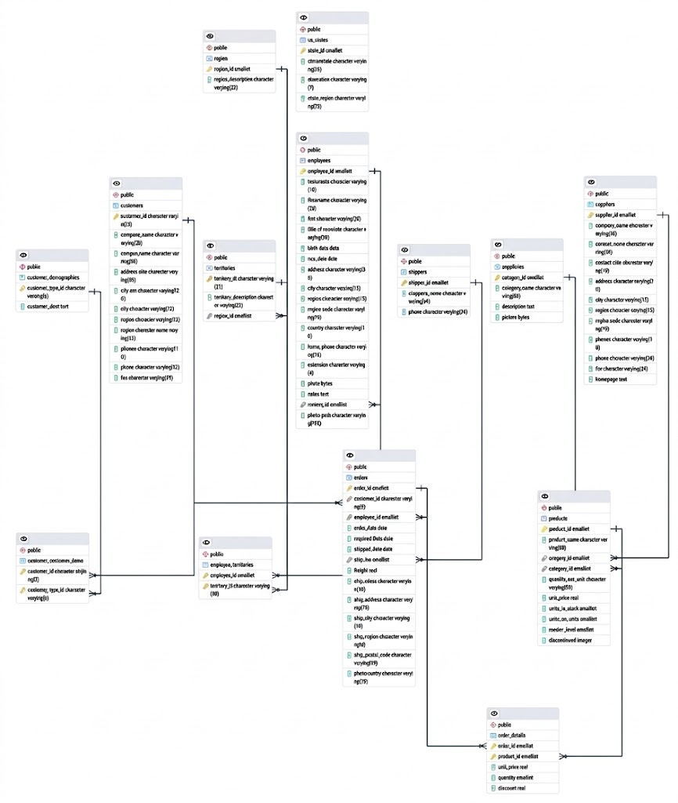

# Práctica de PostgreSQL: Ejercicios modelo

**Autor/a:** Christian Salguero Varas

---

## Entorno Utilizado

* **Sistema Gestor de Base de Datos (SGBD):** PostgreSQL 18
* **Herramienta de Administración:** pgAdmin 4 (Versión `9.18`)

---

## Instrucciones para Reproducir el Trabajo

Sigue estos pasos para clonar o replicar la base de datos en tu entorno local:

1. **Crear la base de datos:**
    Abre pgAdmin, click derecho en `Databases (x)` > `Create` > `Database`. En la ventana que se abre indicamos el nombre de la base de datos. Yo la nombré como `northdiwn`.
2. **Cargamos las tablas y datos:**
    Pulsamos sobre la base de datos que acabamos de crear y en las opciones de la aplicación (arriba del todo) pulsamos `Tools` > `Query Tool` o `Alt + Shift + Q`. Ahora arrastramos nuestro fichero que contiene las tablas y datos y pulsamos el botón de lanzar.

## Diagrama Entidad-Relación (ER)

## Índice de respuestas

Puedes consultar el desarrollo detallado y las soluciones de cada bloque de ejercicios en el siguiente enlace:
[Ir a respuestas.md](respuestas.md)