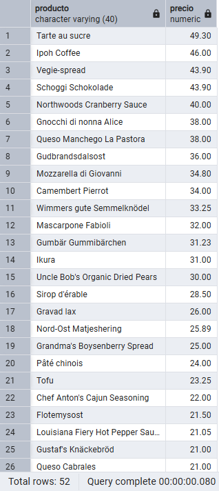
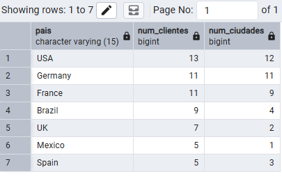
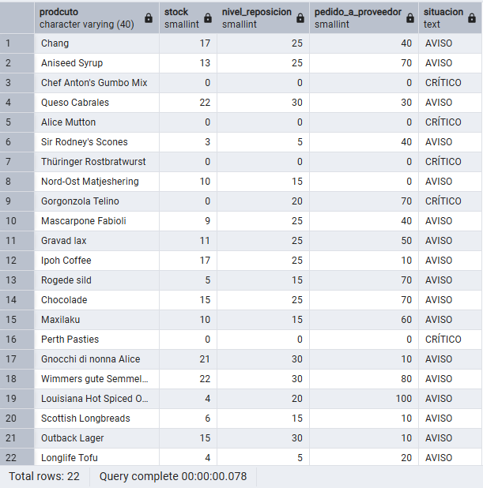
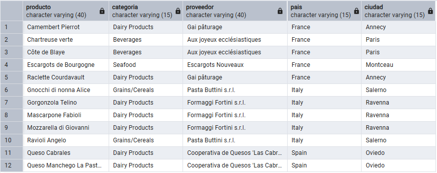
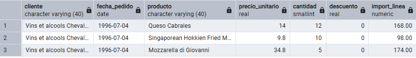
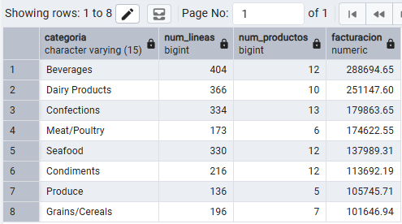

# Repuestas
---

## Pregunta 1 — Catálogo comercial activo

**Enunciado:** El equipo de ventas prepara la tarifa de la próxima campaña y necesita el catálogo depurado.
Obtén los productos que **no** están descatalogados y cuyo precio unitario esté entre 10 y 50 euros, ambos incluidos. Muestra el nombre del producto y su precio redondeado a dos decimales, ordenado de mayor a menor precio.

**Consulta:**

```sql
SELECT
	PRODUCT_NAME AS PRODUCTO,
	ROUND(UNIT_PRICE::NUMERIC, 2) AS PRECIO
FROM
	PRODUCTS
WHERE
	UNIT_PRICE BETWEEN 10 AND 50
	AND DISCONTINUED = 0
ORDER BY
	UNIT_PRICE DESC;
```

**Resultado:**



**Comentario:** Utilizo los alias en ambos campos del select para poder visualizarlo en español. Utilizo ::numeric en unit_price dentro del round() para evitar errores con el tipo de dato real e indico el número 2 ya que es la cantidad de decimales que quiero. En el where he usado between para poder filtrar con un rango y luego comparo discontinued = 0 porque 0 es que el producto está continuado y 1 es que está descontinuado.

## Pregunta 2 — Concentración geográfica de la cartera

**Enunciado:** Dirección quiere saber en qué mercados está realmente concentrada la base de clientes antes de decidir dónde abrir delegación.
Cuenta cuántos clientes hay en cada país y muestra únicamente aquellos países con **5 o más clientes**, ordenados de mayor a menor. Indica también cuántas ciudades distintas hay en cada uno de esos países.

**Consulta:**

```sql
SELECT
	COUNTRY AS PAIS,
	COUNT(CUSTOMER_ID) AS NUM_CLIENTES,
	COUNT(DISTINCT CITY) AS NUM_CIUDADES
FROM
	CUSTOMERS
GROUP BY
	COUNTRY
HAVING
	COUNT(CUSTOMER_ID) >= 5
ORDER BY
	COUNT(CUSTOMER_ID) DESC;
```

**Resultado:**



**Comentario:** ...

## Pregunta 3 — Alerta de reposición

**Enunciado:** Logística necesita detectar qué referencias están en riesgo de rotura de stock.
Localiza los productos activos cuyas unidades en stock sean **inferiores o iguales** a su nivel de reposición. Muestra el nombre, las unidades en stock, el nivel de reposición, las unidades ya pedidas al proveedor y una columna de texto que indique `'CRÍTICO'` cuando el stock sea 0 y `'AVISO'` en el resto de casos.

**Consulta:**

```sql
SELECT
SELECT
	PRODUCT_NAME AS PRODCUTO,
	UNITS_IN_STOCK AS STOCK,
	REORDER_LEVEL AS NIVEL_REPOSICION,
	UNITS_ON_ORDER AS PEDIDO_A_PROVEEDOR,
	CASE
		WHEN UNITS_IN_STOCK = 0 THEN 'CRÍTICO'
		ELSE 'AVISO'
	END AS SITUACION
FROM
	PRODUCTS
WHERE
	COALESCE(UNITS_IN_STOCK, 0) <= COALESCE(REORDER_LEVEL, 0);
```

**Resultado:**



**Comentario:** ...

## Pregunta 4 — Ficha completa de producto

**Enunciado:** Marketing va a rehacer el catálogo impreso y necesita cada producto con su categoría y los datos de contacto de quien lo suministra.
Para los productos suministrados por empresas de **Italia, Francia o España**, muestra el nombre del producto, el nombre de la categoría, el nombre del proveedor, su país y su ciudad. Ordena por país y, dentro de cada país, por nombre de producto.

**Consulta:**

```sql
SELECT
	P.PRODUCT_NAME AS PRODUCTO,
	C.CATEGORY_NAME AS CATEGORIA,
	S.COMPANY_NAME AS PROVEEDOR,
	S.COUNTRY AS PAIS,
	S.CITY AS CIUDAD
FROM
	PRODUCTS P
	INNER JOIN SUPPLIERS S USING (SUPPLIER_ID)
	INNER JOIN CATEGORIES C USING (CATEGORY_ID)
WHERE
	S.COUNTRY IN ('Italy', 'France', 'Spain')
ORDER BY
	S.COUNTRY,
	P.PRODUCT_NAME;
```

**Resultado:**



**Comentario:** ...

## Pregunta 5 — Detalle valorizado de un pedido

**Enunciado:** Atención al cliente recibe una reclamación sobre el pedido **10248** y necesita reconstruir la factura línea a línea.
Muestra, para ese pedido, el nombre del producto, el precio unitario aplicado, la cantidad, el descuento y el importe final de cada línea. Añade el nombre del cliente y la fecha del pedido.

**Consulta:**

```sql
SELECT
	C.COMPANY_NAME AS CLIENTE,
	O.ORDER_DATE AS FECHA_PEDIDO,
	P.PRODUCT_NAME AS PRODUCTO,
	OD.UNIT_PRICE AS PRECIO_UNITARIO,
	OD.QUANTITY AS CANTIDAD,
	OD.DISCOUNT AS DESCUENTO,
	ROUND(
		OD.UNIT_PRICE::NUMERIC * OD.QUANTITY * (1 - OD.DISCOUNT::NUMERIC),
		2
	) AS IMPORTE_LINEA
FROM
	ORDERS O
	INNER JOIN CUSTOMERS C USING (CUSTOMER_ID)
	INNER JOIN ORDER_DETAILS OD USING (ORDER_ID)
	INNER JOIN PRODUCTS P USING (PRODUCT_ID)
WHERE
	ORDER_ID = 10248;
```

**Resultado:**



**Comentario:** ...

## Pregunta 6 — Ranking de categorías por facturación

**Enunciado:** Comité de dirección: ¿qué familias de producto sostienen realmente el negocio?
Calcula la facturación total de cada categoría durante toda la historia de la compañía. Muestra el nombre de la categoría, el número de líneas de pedido que ha generado, el número de productos distintos vendidos y la facturación total. Incluye únicamente las categorías que superen los **100.000 euros** de facturación, ordenadas de mayor a menor.

**Consulta:**

```sql
SELECT
	C.CATEGORY_NAME AS CATEGORIA,
	COUNT(*) AS NUM_LINEAS,
	COUNT(DISTINCT P.PRODUCT_ID) AS NUM_PRODUCTOS,
	ROUND(SUM(P.UNIT_PRICE::NUMERIC * O.QUANTITY * (1 - O.DISCOUNT::NUMERIC)), 2) AS FACTURACION
FROM
	PRODUCTS P
	INNER JOIN CATEGORIES C USING (CATEGORY_ID)
	INNER JOIN ORDER_DETAILS O USING (PRODUCT_ID)
GROUP BY
	C.CATEGORY_NAME
HAVING
	SUM(P.UNIT_PRICE::NUMERIC * O.QUANTITY * (1 - O.DISCOUNT::NUMERIC)) > 100000
ORDER BY
	SUM(P.UNIT_PRICE::NUMERIC * O.QUANTITY * (1 - O.DISCOUNT::NUMERIC)) DESC;
```

**Resultado:**



**Comentario:** ...