# Repuestas
---

## Pregunta 1 — Catálogo comercial activo

**Enunciado:** El equipo de ventas prepara la tarifa de la próxima campaña y necesita el catálogo depurado.
Obtén los productos que **no** están descatalogados y cuyo precio unitario esté entre 10 y 50 euros, ambos incluidos. Muestra el nombre del producto y su precio redondeado a dos decimales, ordenado de mayor a menor precio.

**Consulta:**

```sql
SELECT
	PRODUCT_NAME AS PRODUCTO,
	ROUND(UNIT_PRICE::NUMERIC, 2) AS PRECIO
FROM
	PRODUCTS
WHERE
	UNIT_PRICE BETWEEN 10 AND 50
	AND DISCONTINUED = 0
ORDER BY
	UNIT_PRICE DESC;
```

**Resultado:**


**Comentario:** Utilizo los alias en ambos campos del select para poder visualizarlo en español. Utilizo ::numeric en unit_price dentro del round() para evitar errores con el tipo de dato real e indico el número 2 ya que es la cantidad de decimales que quiero. En el where he usado between para poder filtrar con un rango y luego comparo discontinued = 0 porque 0 es que el producto está continuado y 1 es que está descontinuado. Me sorprendió que hubiera bastantes productos justo en el límite de 50, así que comprobé a mano un par de filas para asegurarme de que entraban.

## Pregunta 2 — Concentración geográfica de la cartera

**Enunciado:** Dirección quiere saber en qué mercados está realmente concentrada la base de clientes antes de decidir dónde abrir delegación.
Cuenta cuántos clientes hay en cada país y muestra únicamente aquellos países con **5 o más clientes**, ordenados de mayor a menor. Indica también cuántas ciudades distintas hay en cada uno de esos países.

**Consulta:**

```sql
SELECT
	COUNTRY AS PAIS,
	COUNT(CUSTOMER_ID) AS NUM_CLIENTES,
	COUNT(DISTINCT CITY) AS NUM_CIUDADES
FROM
	CUSTOMERS
GROUP BY
	COUNTRY
HAVING
	COUNT(CUSTOMER_ID) >= 5
ORDER BY
	COUNT(CUSTOMER_ID) DESC;
```

**Resultado:**


**Comentario:** Puse COUNT(DISTINCT city) para que no contara la misma ciudad varias veces si hay dos o más clientes en la misma ciudad. Lo que más me llamó la atención es que algunos países con muchos clientes en realidad están concentrados en muy pocas ciudades.

## Pregunta 3 — Alerta de reposición

**Enunciado:** Logística necesita detectar qué referencias están en riesgo de rotura de stock.
Localiza los productos activos cuyas unidades en stock sean **inferiores o iguales** a su nivel de reposición. Muestra el nombre, las unidades en stock, el nivel de reposición, las unidades ya pedidas al proveedor y una columna de texto que indique `'CRÍTICO'` cuando el stock sea 0 y `'AVISO'` en el resto de casos.

**Consulta:**

```sql
SELECT
SELECT
	PRODUCT_NAME AS PRODCUTO,
	UNITS_IN_STOCK AS STOCK,
	REORDER_LEVEL AS NIVEL_REPOSICION,
	UNITS_ON_ORDER AS PEDIDO_A_PROVEEDOR,
	CASE
		WHEN UNITS_IN_STOCK = 0 THEN 'CRÍTICO'
		ELSE 'AVISO'
	END AS SITUACION
FROM
	PRODUCTS
WHERE
	COALESCE(UNITS_IN_STOCK, 0) <= COALESCE(REORDER_LEVEL, 0);
```

**Resultado:**


**Comentario:** Antes de escribir el WHERE comprobé si units_in_stock o reorder_level admitían nulos, porque si alguna fuera NULL la comparación desaparece sin dar error y me habría faltado gente sin darme cuenta. Usé CASE WHEN para no tener que hacer dos consultas separadas para el caso crítico y el de aviso.

## Pregunta 4 — Ficha completa de producto

**Enunciado:** Marketing va a rehacer el catálogo impreso y necesita cada producto con su categoría y los datos de contacto de quien lo suministra.
Para los productos suministrados por empresas de **Italia, Francia o España**, muestra el nombre del producto, el nombre de la categoría, el nombre del proveedor, su país y su ciudad. Ordena por país y, dentro de cada país, por nombre de producto.

**Consulta:**

```sql
SELECT
	P.PRODUCT_NAME AS PRODUCTO,
	C.CATEGORY_NAME AS CATEGORIA,
	S.COMPANY_NAME AS PROVEEDOR,
	S.COUNTRY AS PAIS,
	S.CITY AS CIUDAD
FROM
	PRODUCTS P
	INNER JOIN SUPPLIERS S USING (SUPPLIER_ID)
	INNER JOIN CATEGORIES C USING (CATEGORY_ID)
WHERE
	S.COUNTRY IN ('Italy', 'France', 'Spain')
ORDER BY
	S.COUNTRY,
	P.PRODUCT_NAME;
```

**Resultado:**


**Comentario:** Tuve que unir tres tablas porque el país no está en products, está en suppliers, por lo que me hizo falta pasar por ahí para llegar a esa información. Usé IN en vez de tres OR porque es más corto y se lee mejor. Ordené primero por país y luego por producto tal como pide el enunciado, cosa que se me olvidó la primera vez que lo hice.

## Pregunta 5 — Detalle valorizado de un pedido

**Enunciado:** Atención al cliente recibe una reclamación sobre el pedido **10248** y necesita reconstruir la factura línea a línea.
Muestra, para ese pedido, el nombre del producto, el precio unitario aplicado, la cantidad, el descuento y el importe final de cada línea. Añade el nombre del cliente y la fecha del pedido.

**Consulta:**

```sql
SELECT
	C.COMPANY_NAME AS CLIENTE,
	O.ORDER_DATE AS FECHA_PEDIDO,
	P.PRODUCT_NAME AS PRODUCTO,
	OD.UNIT_PRICE AS PRECIO_UNITARIO,
	OD.QUANTITY AS CANTIDAD,
	OD.DISCOUNT AS DESCUENTO,
	ROUND(
		OD.UNIT_PRICE::NUMERIC * OD.QUANTITY * (1 - OD.DISCOUNT::NUMERIC),
		2
	) AS IMPORTE_LINEA
FROM
	ORDERS O
	INNER JOIN CUSTOMERS C USING (CUSTOMER_ID)
	INNER JOIN ORDER_DETAILS OD USING (ORDER_ID)
	INNER JOIN PRODUCTS P USING (PRODUCT_ID)
WHERE
	ORDER_ID = 10248;
```

**Resultado:**


**Comentario:** Usé USING en vez de ON a.col = b.col porque order_id y product_id se llaman igual a las dos tablas. Apliqué el ::numeric en el cálculo del importe porque si no, al ser real, arrastra errores de redondeo, como se explica en la introducción de la práctica.

## Pregunta 6 — Ranking de categorías por facturación

**Enunciado:** Comité de dirección: ¿qué familias de producto sostienen realmente el negocio?
Calcula la facturación total de cada categoría durante toda la historia de la compañía. Muestra el nombre de la categoría, el número de líneas de pedido que ha generado, el número de productos distintos vendidos y la facturación total. Incluye únicamente las categorías que superen los **100.000 euros** de facturación, ordenadas de mayor a menor.

**Consulta:**

```sql
SELECT
	C.CATEGORY_NAME AS CATEGORIA,
	COUNT(*) AS NUM_LINEAS,
	COUNT(DISTINCT P.PRODUCT_ID) AS NUM_PRODUCTOS,
	ROUND(SUM(P.UNIT_PRICE::NUMERIC * O.QUANTITY * (1 - O.DISCOUNT::NUMERIC)), 2) AS FACTURACION
FROM
	PRODUCTS P
	INNER JOIN CATEGORIES C USING (CATEGORY_ID)
	INNER JOIN ORDER_DETAILS O USING (PRODUCT_ID)
GROUP BY
	C.CATEGORY_NAME
HAVING
	SUM(P.UNIT_PRICE::NUMERIC * O.QUANTITY * (1 - O.DISCOUNT::NUMERIC)) > 100000
ORDER BY
	FACTURACION DESC;
```

**Resultado:**


**Comentario:** En el HAVING tuve que repetir la fórmula completa de la facturación porque no puedes usar el alias facturacion ahí, PostgreSQL todavía no lo conoce en ese punto de la consulta. Usé COUNT(DISTINCT p.product_id) porque si no, un producto que aparece en varias líneas se contaría varias veces como si fueran productos distintos.

## Pregunta 7 — Clientes sin actividad comercial

**Enunciado:** Dirección comercial sospecha que hay cuentas abiertas que nunca han llegado a comprar.
Lista **todos** los clientes con el número de pedidos que ha realizado cada uno y la fecha de su último pedido. Los clientes sin ningún pedido deben aparecer igualmente, con un 0 en el conteo y el texto `'SIN PEDIDOS'` en lugar de la fecha. Ordena de forma que los clientes inactivos aparezcan primero.

**Consulta:**

```sql
SELECT
	C.COMPANY_NAME AS CLIENTE,
	C.COUNTRY AS PAIS,
	COUNT(O.ORDER_ID) AS NUM_PEDIDOS,
	COALESCE(
		TO_CHAR(MAX(O.ORDER_DATE), 'YYYY-MM-DD'),
		'SIN PEDIDOS'
	) AS ULTIMO_PEDIDO
FROM
	CUSTOMERS C
	LEFT JOIN ORDERS O ON C.CUSTOMER_ID = O.CUSTOMER_ID
GROUP BY
	C.CUSTOMER_ID,
	C.COMPANY_NAME,
	C.COUNTRY
ORDER BY
	NUM_PEDIDOS ASC,
	CLIENTE ASC;
```

**Resultado:**

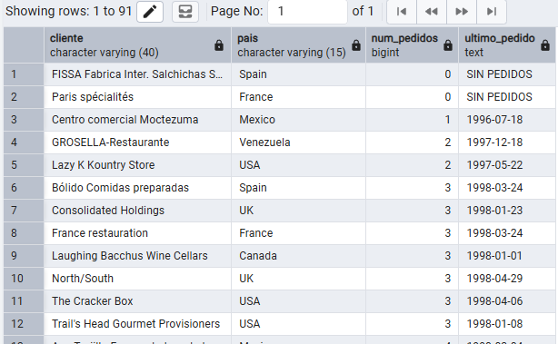

**Comentario:** Usé LEFT JOIN para que los clientes sin pedidos no desaparezcan del resultado. Elegí COUNT(o.order_id) y no COUNT(*) porque COUNT(*) cuenta la fila aunque esté rellena de nulos por el LEFT JOIN, y me habría dado pedidos para clientes que en realidad no tienen ninguno. Tuve que castear la fecha a texto dentro del COALESCE porque si no, al mezclar una fecha con el literal 'SIN PEDIDOS' los tipos no coinciden y da error.

## Pregunta 8 — Organigrama de la fuerza de ventas

**Enunciado:** Recursos Humanos necesita el organigrama del departamento comercial en formato tabla.
Muestra cada empleado con su nombre completo, su cargo, el nombre completo de la persona a la que reporta y el cargo de esa persona. El empleado que no reporta a nadie debe aparecer también, con el texto `'DIRECCIÓN GENERAL'` en el campo del responsable.

**Consulta:**

```sql
SELECT
	E.FIRST_NAME || ' ' || E.LAST_NAME AS EMPLEADO,
	E.TITLE AS CARGO,
	COALESCE(
		J.FIRST_NAME || ' ' || J.LAST_NAME,
		'DIRECCIÓN GENERAL'
	) AS RESPONSABLE,
	COALESCE(J.TITLE, 'DIRECCIÓN GENERAL') AS CARGO_RESPONSABLE
FROM
	EMPLOYEES E
	LEFT JOIN EMPLOYEES J ON E.REPORTS_TO = J.EMPLOYEE_ID
ORDER BY
	RESPONSABLE,
	EMPLEADO;
```

**Resultado:**

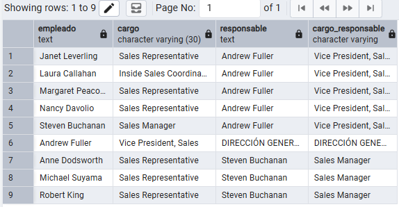

**Comentario:** Usé LEFT JOIN en vez de INNER JOIN porque la persona que no reporta a nadie tiene reports_to nulo, y con INNER JOIN esa fila desaparecería del resultado. El COALESCE lo puse solo en el nombre del responsable porque el cargo del responsable sí puede quedar en blanco sin problema.

## Pregunta 9 — Rejilla de cobertura categoría × año

**Enunciado:** Control de gestión quiere una rejilla completa de facturación por categoría y año, **sin huecos**: si una categoría no vendió nada en un año concreto, debe aparecer con un 0, no desaparecer de la tabla.
Genera todas las combinaciones posibles de las 8 categorías con los 3 años del histórico (24 filas) y asocia a cada combinación su facturación. Ordena por categoría y año.

**Consulta:**

```sql
SELECT
	C.CATEGORY_NAME AS CATEGORIA,
	A.ANIO,
	ROUND(COALESCE(V.FACTURACION, 0)::NUMERIC, 2) AS FACTURACION
FROM
	CATEGORIES C
	CROSS JOIN (
		SELECT DISTINCT
			EXTRACT(
				YEAR
				FROM
					ORDER_DATE
			) AS ANIO
		FROM
			ORDERS
	) A
	LEFT JOIN (
		SELECT
			P.CATEGORY_ID,
			EXTRACT(
				YEAR
				FROM
					O.ORDER_DATE
			) AS ANIO,
			SUM(OD.UNIT_PRICE * OD.QUANTITY * (1 - OD.DISCOUNT)) AS FACTURACION
		FROM
			ORDERS O
			JOIN ORDER_DETAILS OD ON O.ORDER_ID = OD.ORDER_ID
			JOIN PRODUCTS P ON OD.PRODUCT_ID = P.PRODUCT_ID
		GROUP BY
			P.CATEGORY_ID,
			EXTRACT(
				YEAR
				FROM
					O.ORDER_DATE
			)
	) V ON C.CATEGORY_ID = V.CATEGORY_ID
	AND A.ANIO = V.ANIO
ORDER BY
	CATEGORIA,
	ANIO;
```

**Resultado:**

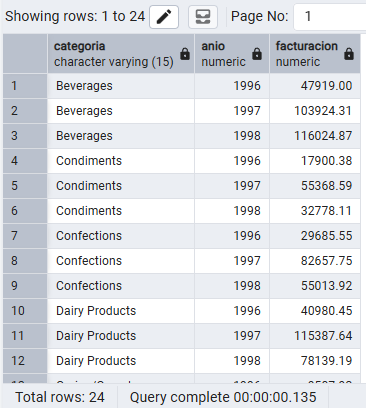

**Comentario:** Primero usé CROSS JOIN (8 categorías por 3 años = 24 filas) y después puse los datos reales con LEFT JOIN, tal como dice la pista, porque si lo hago al revés las combinaciones sin ventas no aparecerían nunca. Usé COALESCE para convertir el NULL del LEFT JOIN en un 0.

## Pregunta 10 — Mapa de países: clientes frente a proveedores

**Enunciado:** Expansión internacional quiere una única tabla que muestre, para cada país en el que la compañía tiene presencia, cuántos clientes y cuántos proveedores hay. Deben aparecer los países que solo tienen clientes, los que solo tienen proveedores y los que tienen ambos.

**Consulta:**

```sql
SELECT
	COALESCE(C.COUNTRY, P.COUNTRY) AS PAIS,
	COALESCE(C.NUM_CLIENTES, 0) AS NUM_CLIENTES,
	COALESCE(P.NUM_PROVEEDORES, 0) AS NUM_PROVEEDORES,
	CASE
		WHEN C.NUM_CLIENTES > 0
		AND P.NUM_PROVEEDORES > 0 THEN 'AMBOS'
		WHEN C.NUM_CLIENTES > 0 THEN 'SOLO CLIENTES'
		ELSE 'SOLO PROVEEDORES'
	END AS TIPO_PRESENCIA
FROM
	(
		SELECT
			COUNTRY,
			COUNT(*) AS NUM_CLIENTES
		FROM
			CUSTOMERS
		GROUP BY
			COUNTRY
	) C
	FULL JOIN (
		SELECT
			COUNTRY,
			COUNT(*) AS NUM_PROVEEDORES
		FROM
			SUPPLIERS
		GROUP BY
			COUNTRY
	) P ON C.COUNTRY = P.COUNTRY
ORDER BY
	PAIS;
```

**Resultado:**

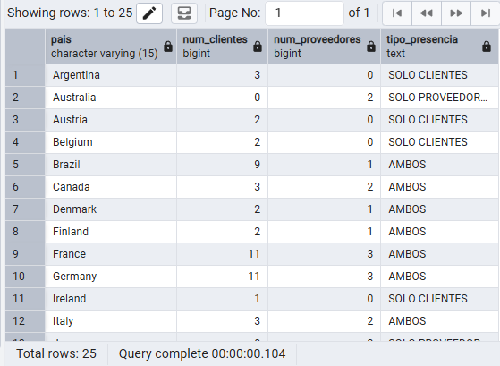

**Comentario:** Usé COALESCE(cli.country, prov.country) porque en un FULL JOIN la columna de país puede venir nula por cualquiera de los dos lados, y si pongo solo cli.country pierdo los países que solo tienen proveedores. Preferí calcular clientes y proveedores en dos CTE separadas y luego cruzarlas, en vez de un solo JOIN directo entre customers y suppliers, porque así evito multiplicar filas si un país tiene varios clientes y varios proveedores a la vez.

## Pregunta 11 — Directorio unificado de contactos

**Enunciado:** Sistemas va a migrar el CRM y necesita una exportación única con todos los contactos de la compañía, vengan de donde vengan.
Construye una sola tabla que reúna los contactos de clientes, los de proveedores y los empleados. Cada fila debe indicar el origen (`'CLIENTE'`, `'PROVEEDOR'`, `'EMPLEADO'`), el nombre de la persona de contacto **en mayúsculas**, la organización a la que pertenece, la ciudad y el país. Para los empleados, la organización es el literal `'NORTHWIND TRADERS'` y el nombre de contacto se forma concatenando nombre y apellidos.
Ordena por origen y luego por país.

**Consulta:**

```sql
SELECT
	'CLIENTE' AS ORIGEN,
	UPPER(CONTACT_NAME) AS CONTACTO,
	COMPANY_NAME AS ORGANIZACION,
	CITY AS CIUDAD,
	COUNTRY AS PAIS
FROM
	CUSTOMERS
UNION ALL
SELECT
	'PROVEEDOR' AS ORIGEN,
	UPPER(CONTACT_NAME) AS CONTACTO,
	COMPANY_NAME AS ORGANIZACION,
	CITY AS CIUDAD,
	COUNTRY AS PAIS
FROM
	SUPPLIERS
UNION ALL
SELECT
	'EMPLEADO' AS ORIGEN,
	UPPER(FIRST_NAME || ' ' || LAST_NAME) AS CONTACTO,
	'NORTHWIND TRADERS' AS ORGANIZACION,
	CITY AS CIUDAD,
	COUNTRY AS PAIS
FROM
	EMPLOYEES
ORDER BY
	ORIGEN,
	PAIS;
```

**Resultado:**

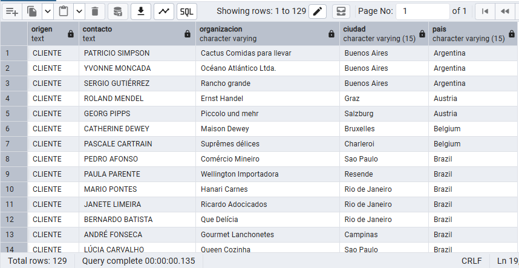

**Comentario:** Usé UNION ALL y no UNION a propósito, porque UNION elimina duplicados y aquí no tiene sentido: si un cliente y un proveedor coincidieran en nombre de contacto y ciudad, UNION me borraría una fila que en realidad representa dos personas distintas de dos organizaciones distintas. Las tres consultas devuelven las mismas cinco columnas en el mismo orden, que es obligatorio para poder unirlas. Para los empleados tuve que inventar la organización como literal porque esa tabla no tiene ninguna columna de organización.

## Pregunta 12 — Mercados con desequilibrio

**Enunciado:** Compras y Ventas mantienen una discusión recurrente: ¿en qué países vendemos sin tener proveedor local, y en cuáles coincidimos?
Resuelve las dos preguntas en dos consultas independientes:
**a)** Países donde hay clientes pero **ningún** proveedor.
**b)** Países donde hay **a la vez** clientes y proveedores.
Ordena ambos resultados alfabéticamente.

**Consulta:**

```sql
-- A) Países donde hay clientes pero ningún proveedor
SELECT
	COUNTRY AS PAIS
FROM
	CUSTOMERS
EXCEPT
SELECT
	COUNTRY AS PAIS
FROM
	SUPPLIERS
ORDER BY
	PAIS;

-- B) Países donde hay a la vez clientes y proveedores
SELECT
	COUNTRY AS PAIS
FROM
	CUSTOMERS
INTERSECT
SELECT
	COUNTRY AS PAIS
FROM
	SUPPLIERS
ORDER BY
	PAIS;
```

**Resultado:**

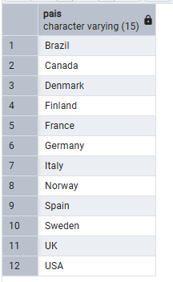

**Comentario:** Usé EXCEPT para el primer apartado porque es literalmente "los países de clientes que no están en la lista de países de proveedores", e INTERSECT para el segundo porque pide justo lo contrario, los que están en las dos listas.

## Pregunta 13 — Clientes que nunca han comprado pescado

**Enunciado:** El responsable de la categoría Seafood quiere una lista de cuentas sobre las que hacer campaña de captación.
Localiza los clientes que **nunca** han incluido un producto de la categoría `'Seafood'` en ninguno de sus pedidos. Muestra el nombre del cliente, su país y el número total de pedidos que sí ha realizado, de mayor a menor.

**Consulta:**

```sql
SELECT
	C.COMPANY_NAME AS CLIENTE,
	C.COUNTRY AS PAIS,
	COUNT(O.ORDER_ID) AS PEDIDOS_REALIZADOS
FROM
	CUSTOMERS C
	LEFT JOIN ORDERS O ON C.CUSTOMER_ID = O.CUSTOMER_ID
WHERE
	NOT EXISTS (
		SELECT
			1
		FROM
			ORDERS O2
			JOIN ORDER_DETAILS OD ON O2.ORDER_ID = OD.ORDER_ID
			JOIN PRODUCTS P ON OD.PRODUCT_ID = P.PRODUCT_ID
			JOIN CATEGORIES CAT ON P.CATEGORY_ID = CAT.CATEGORY_ID
		WHERE
			O2.CUSTOMER_ID = C.CUSTOMER_ID
			AND CAT.CATEGORY_NAME = 'Seafood'
	)
GROUP BY
	C.CUSTOMER_ID,
	C.COMPANY_NAME,
	C.COUNTRY
ORDER BY
	PEDIDOS_REALIZADOS DESC,
	CLIENTE ASC;
```

**Resultado:**

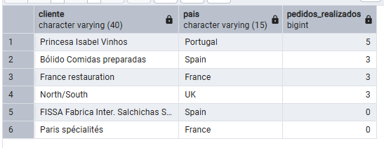

**Comentario:** Elegí NOT EXISTS en vez de NOT IN porque la subconsulta de NOT IN sobre una columna que puede contener algún NULL te deja la consulta entera vacía sin ningún aviso de error, y es justo el tipo de fallo que la pista avisa que es difícil de detectar.

## Pregunta 14 — Productos por encima de la media

**Enunciado:** El comité de precios quiere identificar el segmento premium del catálogo.
Muestra los productos activos cuyo precio unitario supere el precio medio de **todo** el catálogo. Incluye en cada fila el precio del producto, el precio medio general y la diferencia entre ambos, todo redondeado a dos decimales. Ordena por diferencia descendente.

**Consulta:**

```sql
WITH
	MEDIA_CATALOGO AS (
		SELECT
			AVG(UNIT_PRICE) AS VALOR
		FROM
			PRODUCTS
	)
SELECT
	P.PRODUCT_NAME AS PRODUCTO,
	ROUND(P.UNIT_PRICE::NUMERIC, 2) AS PRECIO,
	ROUND(M.VALOR::NUMERIC, 2) AS PRECIO_MEDIO_CATALOGO,
	ROUND((P.UNIT_PRICE - M.VALOR)::NUMERIC, 2) AS DIFERENCIA
FROM
	PRODUCTS P
	CROSS JOIN MEDIA_CATALOGO M
WHERE
	P.DISCONTINUED = 0
	AND P.UNIT_PRICE > M.VALOR
ORDER BY
	DIFERENCIA DESC;
```

**Resultado:**

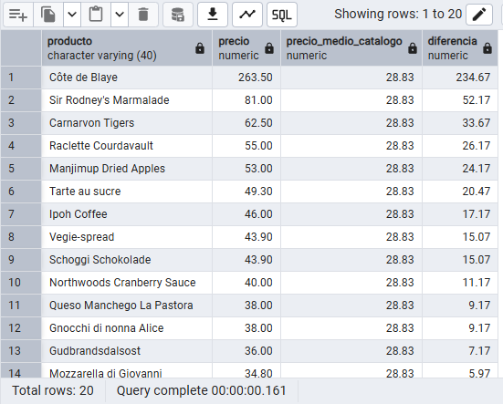

**Comentario:** La subconsulta que calcula la media aparece tres veces porque la necesito en el WHERE para filtrar y otra vez en el SELECT para mostrarla, es repetitiva pero funciona; el enunciado ya avisa de que más adelante se resuelve mejor con un CTE.

## Pregunta 15 — Ticket medio por cliente

**Enunciado:** Dirección comercial quiere segmentar la cartera por valor medio de pedido, no por volumen total.
Calcula, para cada cliente que haya comprado alguna vez, el número de pedidos, el importe total acumulado y el importe medio por pedido. Muestra los 15 clientes con mayor ticket medio.
El cálculo tiene dos niveles: primero hay que obtener el importe de cada pedido sumando sus líneas, y solo después promediar esos importes por cliente. **Promediar directamente las líneas daría un resultado distinto y equivocado.**

**Consulta:**

```sql
SELECT
	SUB.COMPANY_NAME AS CLIENTE,
	SUB.COUNTRY AS PAIS,
	COUNT(SUB.ORDER_ID) AS NUM_PEDIDOS,
	ROUND(SUM(SUB.IMPORTE_PEDIDO)::NUMERIC, 2) AS IMPORTE_TOTAL,
	ROUND(AVG(SUB.IMPORTE_PEDIDO)::NUMERIC, 2) AS TICKET_MEDIO
FROM
	(
		SELECT
			C.CUSTOMER_ID,
			C.COMPANY_NAME,
			C.COUNTRY,
			O.ORDER_ID,
			SUM(OD.UNIT_PRICE * OD.QUANTITY * (1 - OD.DISCOUNT)) AS IMPORTE_PEDIDO
		FROM
			CUSTOMERS C
			JOIN ORDERS O ON C.CUSTOMER_ID = O.CUSTOMER_ID
			JOIN ORDER_DETAILS OD ON O.ORDER_ID = OD.ORDER_ID
		GROUP BY
			C.CUSTOMER_ID,
			C.COMPANY_NAME,
			C.COUNTRY,
			O.ORDER_ID
	) AS SUB
GROUP BY
	SUB.CUSTOMER_ID,
	SUB.COMPANY_NAME,
	SUB.COUNTRY
ORDER BY
	TICKET_MEDIO DESC
LIMIT
	15;
```

**Resultado:**

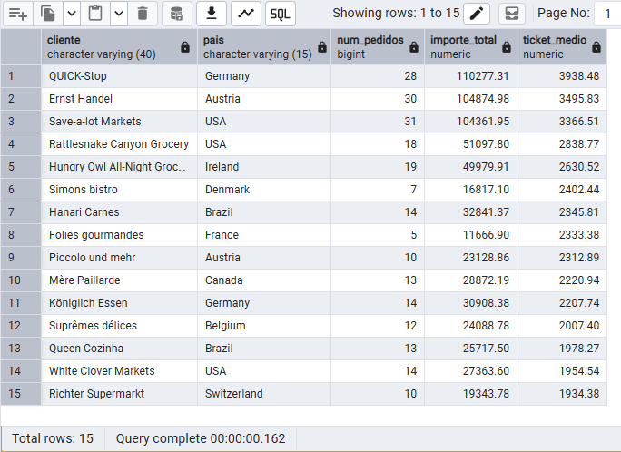

**Comentario:** Hice la subconsulta en dos niveles porque hacer el promedio directamente en las líneas de order_details daría un número distinto y equivocado, como avisa el enunciado. Primero sumo las líneas por pedido dentro de la tabla derivada, y luego divido ese total entre el número de pedidos. Tuve que ponerle alias SUB a la subconsulta porque si no, PostgreSQL da el error de que toda subconsulta en FROM necesita alias, cosa que me pasó al principio. Usé LIMIT 15 al final porque solo se pide el top, no toda la lista de clientes.

## Pregunta 16 — El producto más caro de cada categoría

**Enunciado:** El equipo de compras quiere revisar el posicionamiento de precio en cada familia.
Para cada categoría, muestra el producto con el precio unitario más alto. Incluye el nombre de la categoría, el nombre del producto, su precio y el precio medio de su categoría.
Resuélvelo con una **subconsulta correlacionada**: para cada producto, comprueba si su precio coincide con el máximo de su propia categoría.

**Consulta:**

```sql
SELECT
	CAT.CATEGORY_NAME AS CATEGORIA,
	P.PRODUCT_NAME AS PRODUCTO,
	ROUND(P.UNIT_PRICE::NUMERIC, 2) AS PRECIO,
	ROUND(
		(
			SELECT
				AVG(P2.UNIT_PRICE)
			FROM
				PRODUCTS P2
			WHERE
				P2.CATEGORY_ID = P.CATEGORY_ID
		)::NUMERIC,
		2
	) AS PRECIO_MEDIO_CATEGORIA
FROM
	PRODUCTS P
	JOIN CATEGORIES CAT ON P.CATEGORY_ID = CAT.CATEGORY_ID
WHERE
	P.UNIT_PRICE = (
		SELECT
			MAX(P3.UNIT_PRICE)
		FROM
			PRODUCTS P3
		WHERE
			P3.CATEGORY_ID = P.CATEGORY_ID
	)
ORDER BY
	CATEGORIA;
```

**Resultado:**

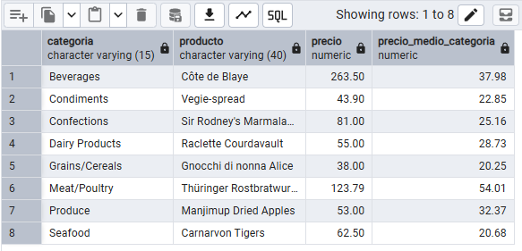

**Comentario:** Las dos subconsultas son correlacionadas porque las dos hacen referencia a p.category_id, que pertenece a la fila de fuera, así que conceptualmente se ejecutan una vez por cada producto. Elegí comparar p.unit_price = MAX(...) en vez de usar ROW_NUMBER() porque el ejercicio pedía explícitamente resolverlo con subconsulta correlacionada.

## Pregunta 17 — Segmentación ABC de la cartera de clientes

**Enunciado:** Dirección quiere clasificar a los clientes en tres tramos de valor para asignar recursos comerciales.
Usando expresiones de tabla común (CTE), construye una consulta que:
1. Calcule la facturación total de cada cliente.
2. Divida los clientes en **cuartiles** según esa facturación.
3. Asigne una etiqueta de segmento: `'A - Estratégico'` al cuartil superior, `'B - Consolidado'` al segundo, `'C - Ocasional'` al tercero y `'D - Marginal'` al cuarto.
4. Devuelva, por segmento, el número de clientes, la facturación total del segmento y el porcentaje que representa sobre el total de la compañía.

**Consulta:**

```sql
WITH
	FACTURACION_CLIENTE AS (
		SELECT
			C.CUSTOMER_ID,
			SUM(OD.UNIT_PRICE * OD.QUANTITY * (1 - OD.DISCOUNT)) AS TOTAL
		FROM
			CUSTOMERS C
			JOIN ORDERS O ON C.CUSTOMER_ID = O.CUSTOMER_ID
			JOIN ORDER_DETAILS OD ON O.ORDER_ID = OD.ORDER_ID
		GROUP BY
			C.CUSTOMER_ID
	),
	CUARTILES AS (
		SELECT
			CUSTOMER_ID,
			TOTAL,
			NTILE(4) OVER (
				ORDER BY
					TOTAL DESC
			) AS CUARTIL
		FROM
			FACTURACION_CLIENTE
	),
	SEGMENTOS AS (
		SELECT
			TOTAL,
			CASE CUARTIL
				WHEN 1 THEN 'A - Estratégico'
				WHEN 2 THEN 'B - Consolidado'
				WHEN 3 THEN 'C - Ocasional'
				WHEN 4 THEN 'D - Marginal'
			END AS SEGMENTO
		FROM
			CUARTILES
	)
SELECT
	SEGMENTO,
	COUNT(*) AS NUM_CLIENTES,
	ROUND(SUM(TOTAL)::NUMERIC, 2) AS FACTURACION_SEGMENTO,
	ROUND(
		(
			100.0 * SUM(TOTAL) / (
				SELECT
					SUM(TOTAL)
				FROM
					FACTURACION_CLIENTE
			)
		)::NUMERIC,
		2
	) AS PORCENTAJE_SOBRE_TOTAL
FROM
	SEGMENTOS
GROUP BY
	SEGMENTO
ORDER BY
	SEGMENTO;
```

**Resultado:**

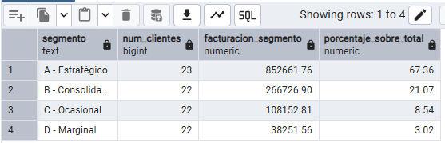

**Comentario:** Encadené tres CTE porque cada una resuelve un paso distinto y así se lee de arriba a abajo como una receta, primero la facturación por cliente, luego los cuartos con NTILE(4) y luego la etiqueta. Ordené NTILE de forma descendente para que el primer cuarto sea el de mayor facturación, que es el que quiero llamar "Estratégico".

## Pregunta 18 — Los tres productos más vendidos de cada categoría

**Enunciado:** El equipo de categoría necesita el podio de cada familia para negociar con proveedores.
Para cada categoría, obtén los **tres productos con mayor facturación**. Muestra la categoría, la posición dentro de la categoría, el nombre del producto, las unidades vendidas y la facturación.
Incluye además una columna con la posición global del producto en el conjunto de la compañía, para que se vea qué productos son líderes de su nicho pero irrelevantes en el total.

**Consulta:**

```sql
WITH
	VENTAS_PRODUCTO AS (
		SELECT
			C.CATEGORY_NAME AS CATEGORIA,
			P.PRODUCT_ID,
			P.PRODUCT_NAME AS PRODUCTO,
			SUM(OD.QUANTITY) AS UNIDADES,
			SUM(OD.UNIT_PRICE * OD.QUANTITY * (1 - OD.DISCOUNT)) AS FACTURACION
		FROM
			PRODUCTS P
			JOIN CATEGORIES C ON P.CATEGORY_ID = C.CATEGORY_ID
			JOIN ORDER_DETAILS OD ON P.PRODUCT_ID = OD.PRODUCT_ID
		GROUP BY
			C.CATEGORY_NAME,
			P.PRODUCT_ID,
			P.PRODUCT_NAME
	),
	RANKINGS AS (
		SELECT
			CATEGORIA,
			PRODUCTO,
			UNIDADES,
			ROUND(FACTURACION::NUMERIC, 2) AS FACTURACION,
			DENSE_RANK() OVER (
				PARTITION BY
					CATEGORIA
				ORDER BY
					FACTURACION DESC
			) AS POSICION_EN_CATEGORIA,
			DENSE_RANK() OVER (
				ORDER BY
					FACTURACION DESC
			) AS POSICION_GLOBAL
		FROM
			VENTAS_PRODUCTO
	)
SELECT
	CATEGORIA,
	POSICION_EN_CATEGORIA,
	PRODUCTO,
	UNIDADES,
	FACTURACION,
	POSICION_GLOBAL
FROM
	RANKINGS
WHERE
	POSICION_EN_CATEGORIA <= 3
ORDER BY
	CATEGORIA,
	POSICION_EN_CATEGORIA;
```

**Resultado:**

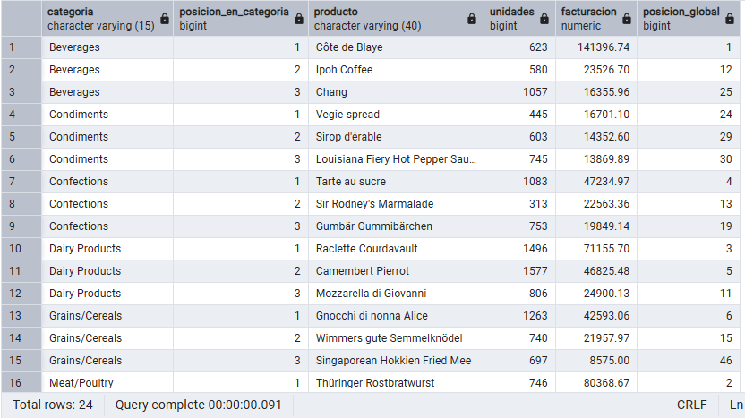

**Comentario:** No pude filtrar posicion_en_categoria <= 3 directamente en un WHERE a la misma altura que calculo el RANK(), porque las funciones de ventana se evalúan después del WHERE; por eso metí el ranking en una CTE y filtré fuera. Usé RANK() en vez de ROW_NUMBER() porque si dos productos empataran en facturación exacta, quiero que compartan posición en vez de que uno gane arbitrariamente al otro.

## Pregunta 19 — Evolución mensual con acumulado y media móvil

**Enunciado:** Control de gestión prepara el cuadro de mando de la evolución del negocio durante 1997.
Para cada mes de 1997, calcula:
- La facturación del mes.
- El total acumulado desde enero.
- La media móvil de los tres últimos meses (el mes actual y los dos anteriores).
- La facturación del mes anterior.
- La variación porcentual respecto al mes anterior.

**Consulta:**

```sql
WITH
	VENTAS_MENSUALES AS (
		SELECT
			DATE_TRUNC('month', O.ORDER_DATE) AS MES,
			SUM(OD.UNIT_PRICE * OD.QUANTITY * (1 - OD.DISCOUNT)) AS FACTURACION
		FROM
			ORDERS O
			JOIN ORDER_DETAILS OD ON O.ORDER_ID = OD.ORDER_ID
		WHERE
			EXTRACT(
				YEAR
				FROM
					O.ORDER_DATE
			) = 1997
		GROUP BY
			DATE_TRUNC('month', O.ORDER_DATE)
	)
SELECT
	TO_CHAR(MES, 'YYYY-MM') AS MES,
	ROUND(FACTURACION::NUMERIC, 2) AS FACTURACION,
	ROUND(
		SUM(FACTURACION) OVER (
			ORDER BY
				MES ROWS BETWEEN UNBOUNDED PRECEDING
				AND CURRENT ROW
		)::NUMERIC,
		2
	) AS ACUMULADO,
	ROUND(
		AVG(FACTURACION) OVER (
			ORDER BY
				MES ROWS BETWEEN 2 PRECEDING
				AND CURRENT ROW
		)::NUMERIC,
		2
	) AS MEDIA_MOVIL_3M,
	ROUND(
		LAG(FACTURACION) OVER (
			ORDER BY
				MES
		)::NUMERIC,
		2
	) AS MES_ANTERIOR,
	ROUND(
		(
			100.0 * (
				FACTURACION - LAG(FACTURACION) OVER (
					ORDER BY
						MES
				)
			) / NULLIF(
				LAG(FACTURACION) OVER (
					ORDER BY
						MES
				),
				0
			)
		)::NUMERIC,
		2
	) AS VARIACION_PCT
FROM
	VENTAS_MENSUALES
ORDER BY
	MES;
```

**Resultado:**

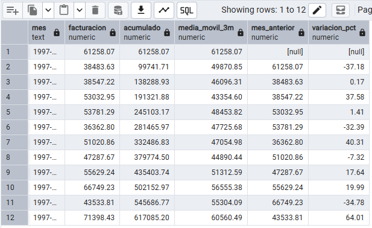

**Comentario:** Para el acumulado no declaré ningún marco porque el comportamiento por defecto de PostgreSQL con ORDER BY (RANGE UNBOUNDED PRECEDING) ya hace justo lo que quiero. Para la media móvil sí tuve que declarar el marco a mano con ROWS BETWEEN 2 PRECEDING AND CURRENT ROW, porque el marco por defecto habría sumado todos los meses anteriores en vez de solo los tres últimos. En enero, LAG() y VARIACION_PCT salen en blanco porque no hay mes anterior, y decidí dejarlo así en vez de forzar un 0.

## Pregunta 20 — Cuadro de mando anual por categoría

**Enunciado:** Última petición, y la más ambiciosa: el informe anual que se presenta al consejo.
Construye una tabla donde cada fila sea una categoría y las columnas muestren la facturación de 1996, 1997 y 1998 en columnas separadas, más el total de los tres años. Añade al final una fila de totales generales.
Incluye además una columna que indique el peso de cada categoría sobre la facturación total de la compañía, y otra que muestre si la categoría creció o decreció entre 1997 y 1998.

**Consulta:**

```sql
WITH
	VENTAS_CATEGORIA AS (
		SELECT
			COALESCE(C.CATEGORY_NAME, 'TOTAL GENERAL') AS CATEGORIA,
			ROUND(
				SUM(
					CASE
						WHEN EXTRACT(
							YEAR
							FROM
								O.ORDER_DATE
						) = 1996 THEN OD.UNIT_PRICE * OD.QUANTITY * (1 - OD.DISCOUNT)
					END
				)::NUMERIC,
				2
			) AS F_1996,
			ROUND(
				SUM(
					CASE
						WHEN EXTRACT(
							YEAR
							FROM
								O.ORDER_DATE
						) = 1997 THEN OD.UNIT_PRICE * OD.QUANTITY * (1 - OD.DISCOUNT)
					END
				)::NUMERIC,
				2
			) AS F_1997,
			ROUND(
				SUM(
					CASE
						WHEN EXTRACT(
							YEAR
							FROM
								O.ORDER_DATE
						) = 1998 THEN OD.UNIT_PRICE * OD.QUANTITY * (1 - OD.DISCOUNT)
					END
				)::NUMERIC,
				2
			) AS F_1998,
			ROUND(
				SUM(OD.UNIT_PRICE * OD.QUANTITY * (1 - OD.DISCOUNT))::NUMERIC,
				2
			) AS TOTAL
		FROM
			CATEGORIES C
			JOIN PRODUCTS P USING (CATEGORY_ID)
			JOIN ORDER_DETAILS OD USING (PRODUCT_ID)
			JOIN ORDERS O USING (ORDER_ID)
		GROUP BY
			ROLLUP (C.CATEGORY_NAME)
	),
	TOTALES AS (
		SELECT
			TOTAL
		FROM
			VENTAS_CATEGORIA
		WHERE
			CATEGORIA = 'TOTAL GENERAL'
	)
SELECT
	V.CATEGORIA,
	COALESCE(V.F_1996, 0) AS F_1996,
	COALESCE(V.F_1997, 0) AS F_1997,
	COALESCE(V.F_1998, 0) AS F_1998,
	V.TOTAL,
	ROUND((100.0 * V.TOTAL / T.TOTAL)::NUMERIC, 2) AS PESO_PCT,
	CASE
		WHEN V.CATEGORIA = 'TOTAL GENERAL' THEN 'N/A'
		WHEN V.F_1998 > V.F_1997 THEN 'CRECE'
		ELSE 'DECRECE'
	END AS TENDENCIA
FROM
	VENTAS_CATEGORIA V,
	TOTALES T
ORDER BY
	(V.CATEGORIA = 'TOTAL GENERAL'),
	V.TOTAL DESC;
```

**Resultado:**

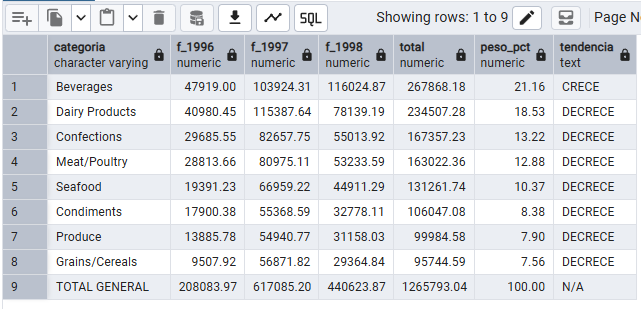

**Comentario:** Usé FILTER (WHERE ...) en vez de meter un CASE WHEN dentro de cada SUM, porque la pista decía que es la sintaxis propia de PostgreSQL y de verdad se lee mejor. ROLLUP(c.category_name) me generó automáticamente la fila de totales sin tener que escribir una segunda consulta con UNION.